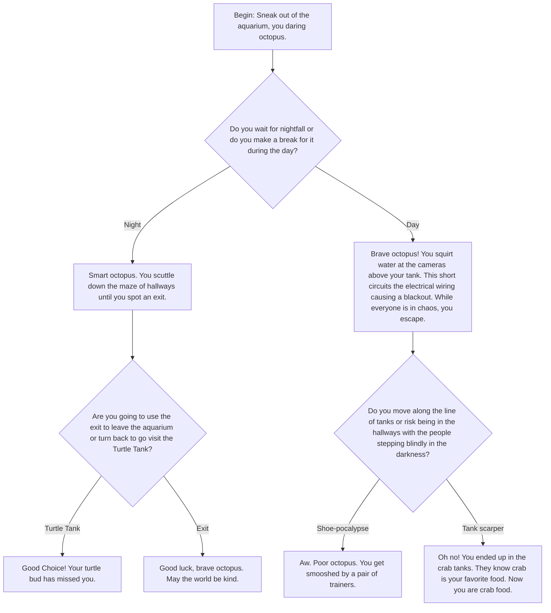

## Make Adventure
You're an octopus who wants to be free. So you have choices. Start at the begining of the graph and choose your escape plan!

For example:
Choice 1
* Do you wait for day or night.
* If you choose day, you move to the day entity.
* If you choose night, you move through the night entities.

Follow through the graph to find out where your choices lead you.

  
